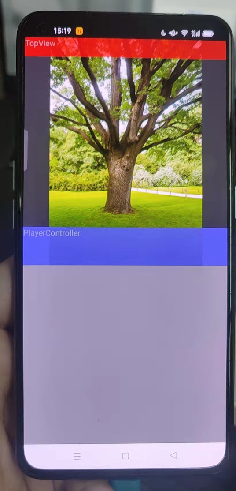

AndroidDemo大全


1、仿造B站竖视频拉伸效果的控件：

{:height="300px" width="300px"}

{:height="300px" width="300px"}


2、类微信样式的图片裁剪控件：

```
https://blog.csdn.net/cjzjolly/article/details/120438494?ops_request_misc=%257B%2522request%255Fid%2522%253A%2522163990911116780274168929%2522%252C%2522scm%2522%253A%252220140713.130102334.pc%255Fblog.%2522%257D&request_id=163990911116780274168929&biz_id=0&utm_medium=distribute.pc_search_result.none-task-blog-2~blog~first_rank_v2~rank_v29-1-120438494.pc_v2_rank_blog_default&utm_term=%E8%A3%81%E5%89%AA&spm=1018.2226.3001.4450
```
.png)


